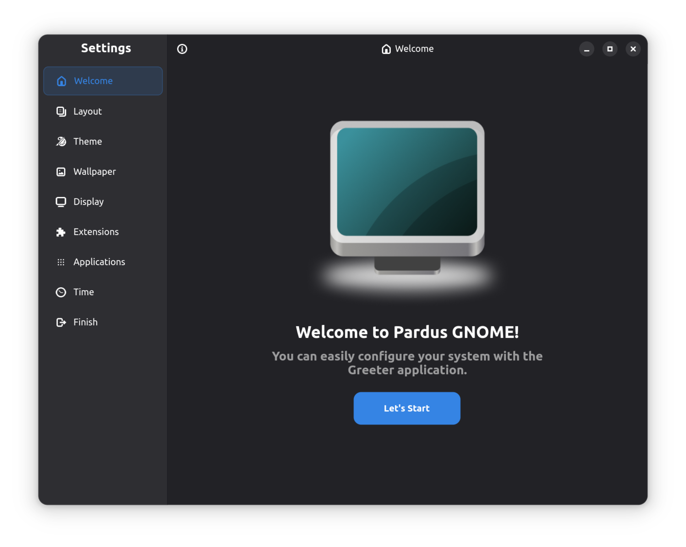
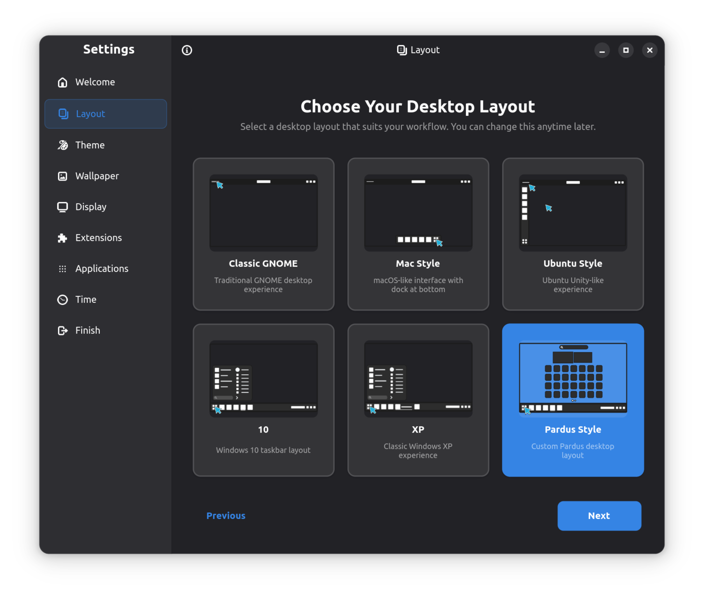
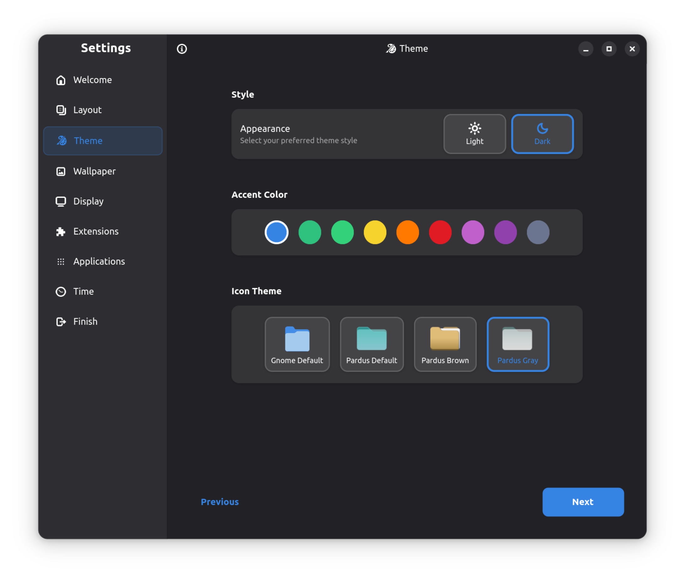
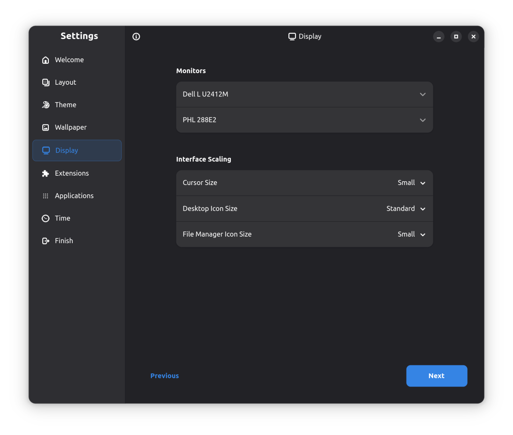
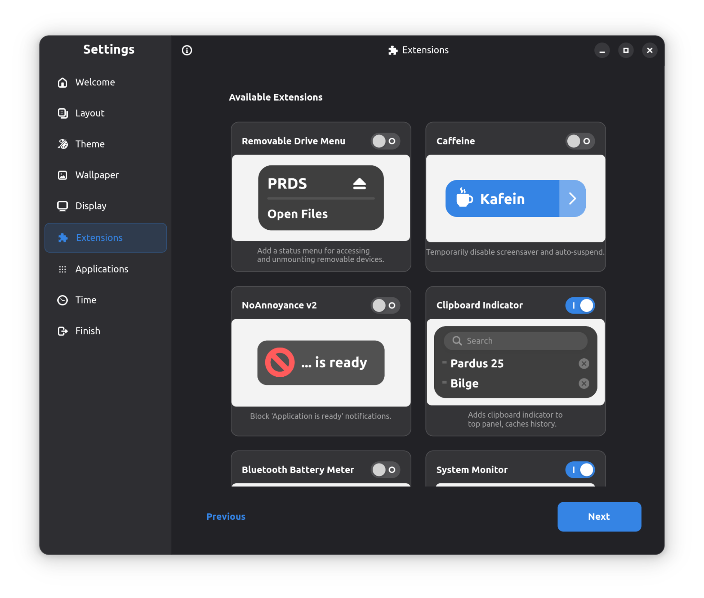
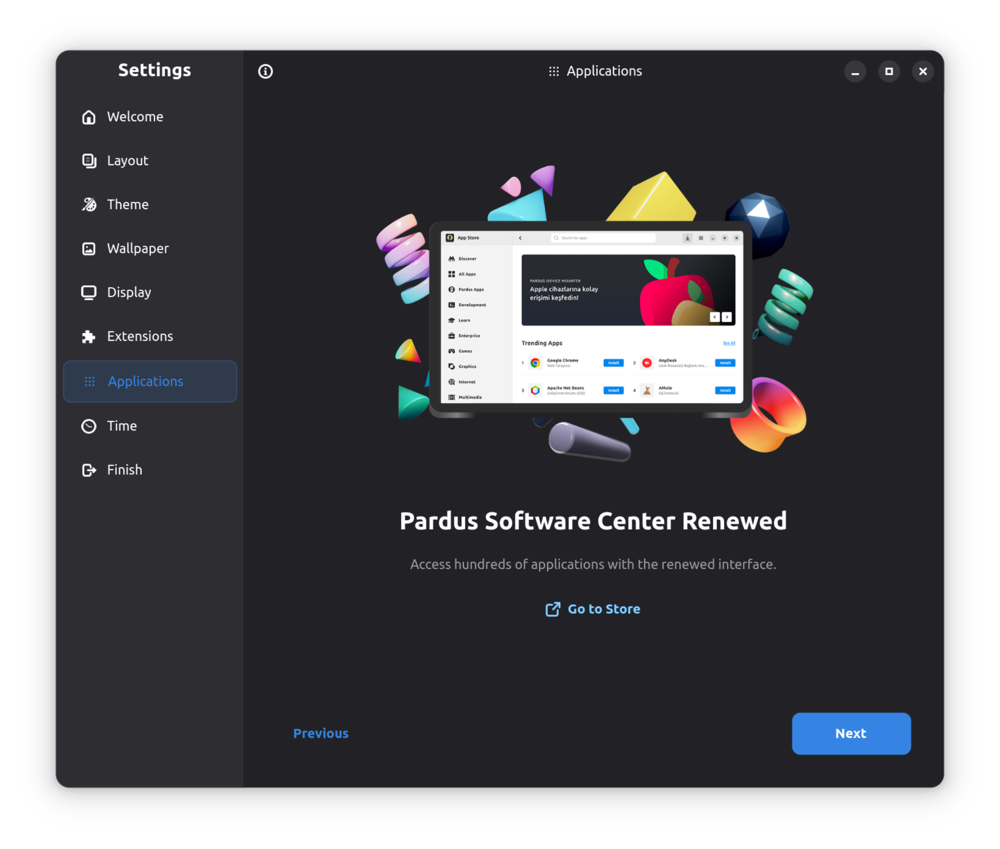
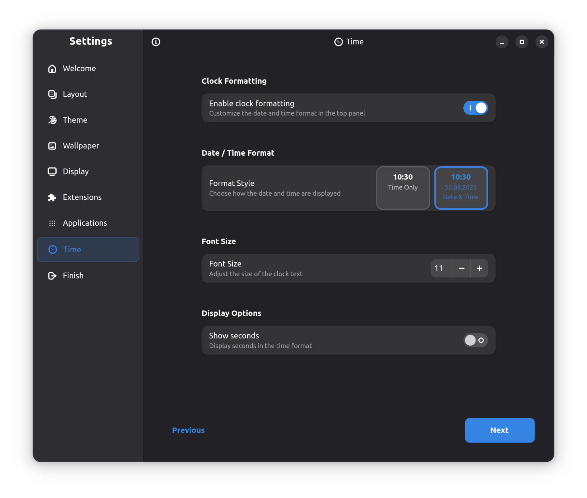
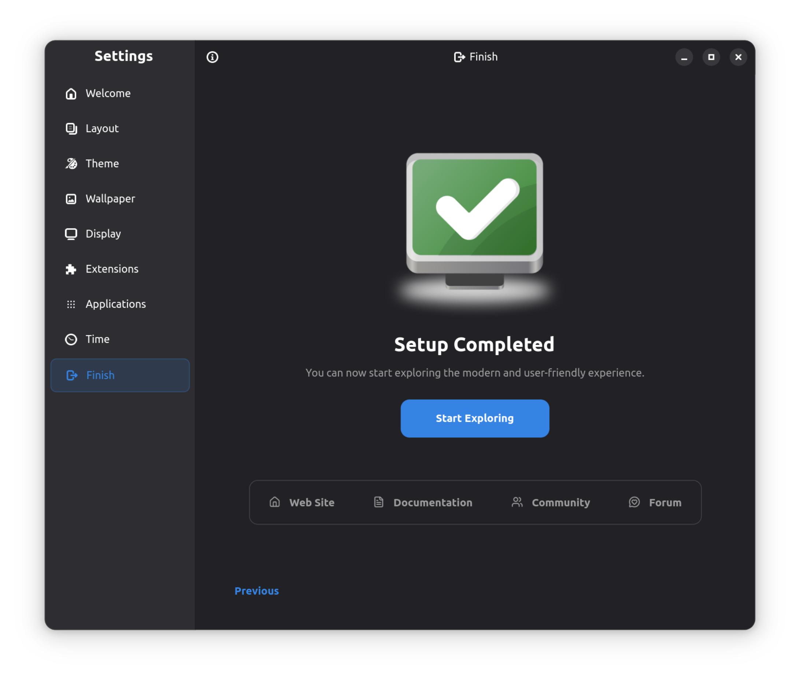

## PARDUS GNOME GREETER

**Pardus GNOME Greeter** is a welcome tour application designed to help users customize and configure their Pardus installation with just a few clicks. It runs automatically on the first login and guides the user through essential settings.

#### Tech Stack
- **Language:** Python 3
- **UI Toolkit:** GTK4 + LibAdwaita (via PyGObject)
- **Build System:** Meson
- **Configuration:** GSettings

#### Architecture & Programming Logic
The application is built using modern GNOME technologies and follows a modular architecture:

1.  **Main Window**: Built using `Adw.ApplicationWindow` and `Adw.SplitView` to ensure responsiveness. It adapts to different screen sizes (desktop/mobile) automatically.
2.  **Navigation**: Uses `Adw.ViewStack` to manage different pages (Welcome, Wallpaper, Theme, etc.). The sidebar (`Gtk.ListBox`) controls the view stack.
3.  **Pages**: Each step in the tour is a separate class located in `src/pardus_gnome_greeter/pages/`. These classes handle the UI logic for specific settings.
4.  **Managers**: The core logic for applying settings is separated into "Managers" located in `src/pardus_gnome_greeter/managers/`. These managers handle interactions with the system (e.g., changing wallpaper via GSettings, managing extensions).

#### Python Library Usage
The project is designed to be reusable. You can import the internal managers in your own Python scripts to programmatically control GNOME settings:

```python
from pardus_gnome_greeter.managers import ThemeManager, WallpaperManager

# Initialize managers
theme_manager = ThemeManager()
wallpaper_manager = WallpaperManager()

# Change the system theme
if theme_manager.set_gtk_theme("Adwaita"):
    print("Theme changed successfully!")

# Change the wallpaper
if wallpaper_manager.set_wallpaper("/usr/share/backgrounds/pardus/pardus-default.png"):
    print("Wallpaper updated!")
```

### Some Screenshots








